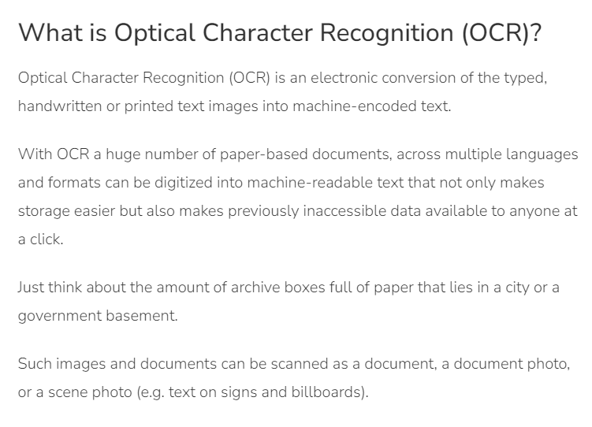

# Image Text Recognition

Este repositório contém um projeto de reconhecimento de texto em imagens. Abaixo estão descritos os passos seguidos, insights obtidos e possíveis aplicações do projeto.

## Estrutura do Projeto

- `inputs/`: Contém as imagens utilizadas para reconhecimento de texto.
- `output/`: Contém os resultados do reconhecimento de texto para cada imagem da pasta `inputs`.

## Processo

1. **Aquisição das Imagens**: As imagens foram coletadas e salvas na pasta `inputs`.
2. **Reconhecimento de Texto**: Foi utilizada uma biblioteca de OCR (Reconhecimento Óptico de Caracteres) para extrair o texto das imagens.
3. **Salvamento dos Resultados**: Os textos extraídos foram salvos na pasta `output`.

## Insights

- **Precisão do OCR**: A precisão do OCR pode variar dependendo da qualidade e complexidade das imagens. Imagens com alta resolução e texto claro produzem melhores resultados.
- **Pré-processamento**: Melhorar a qualidade da imagem (e.g., aumentar o contraste, remover ruído) pode aumentar significativamente a precisão do OCR.
- **Ferramentas**: Bibliotecas como Tesseract são bastante eficazes para tarefas de OCR e possuem várias opções de configuração.

## Possibilidades

- **Automação de Tarefas**: O reconhecimento de texto em imagens pode ser usado para automatizar a entrada de dados de documentos digitalizados.
- **Acessibilidade**: Ferramentas de OCR podem ser integradas a softwares de leitura de tela para ajudar pessoas com deficiência visual.
- **Análise de Documentos**: OCR pode ser usado para digitalizar e indexar grandes volumes de documentos para facilitar a busca e análise.

## Prints

### Exemplo de Imagem de Entrada

### Resultado do Reconhecimento de Texto
[Saida](output/image2.txt)
